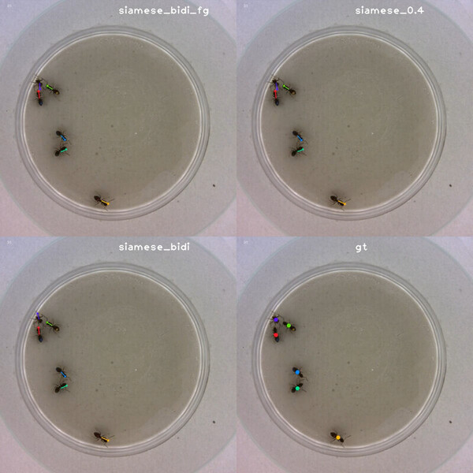

[](https://app.travis-ci.com/github/smidm/motutils)

`motutils` is a Python package for multiple object tracking research with focus on laboratory animals tracking.

# Features

- loads:
  - [MOTChallenge](https://motchallenge.net/) CSV,
  - [sleap](https://sleap.ai/) analysis,
  - [toxtrac](https://sourceforge.net/projects/toxtrac/),
  - [idtracker](https://www.idtracker.es/),
  - [idtrackerai](https://idtrackerai.readthedocs.io/).
- saves: MOTChallenge CSV
- `Mot`, `BboxMot` and `PoseMot` classes backed by xarray dataset with frame and id coordinates
- export to Pandas DataFrame
- oracle detector: fake all knowing detector based on ground truth with configurable inaccuracies
- different classes of tracked objects: point, bounding box, pose
- interpolation of missing positions
- find mapping between MOT results and ground truth
- visualization:
  - tracked positions / objects overlaid on a video
  - montage of multiple videos with results and/or ground truth
- cli
  - visualization
  - evaluation ()
  - mot format conversion



Video comparison of multiple tracking methods and the ground truth.

# Installation

`pip install git+https://github.com/smidm/motutils`

# Usage

```
$ motutils --help
Usage: motutils [OPTIONS] COMMAND [ARGS]...

Options:
--load-mot FILENAME             load a MOT challenge csv file(s)
--load-gt FILENAME              load ground truth from a MOT challenge csv
file
--load-idtracker FILENAME       load IdTracker trajectories (e.g.,
trajectories.txt)
--load-idtrackerai FILENAME     load idtracker.ai trajectories (e.g.,
trajectories_wo_gaps.npy)
--load-sleap-analysis FILENAME  load SLEAP analysis trajectories (exported
from sleap-label File -> Export Analysis
HDF5)
--load-toxtrac FILENAME         load ToxTracker trajectories (e.g.,
Tracking_0.txt)
--toxtrac-topleft-xy <INTEGER INTEGER>...
position of the arena top left corner, see
first tuple in the Arena line in Stats_1.txt
--help                          Show this message and exit.

Commands:
convert    Convert any format to MOT Challenge format.
eval       Evaluate a single MOT file against the ground truth.
visualize  Visualize MOT file(s) overlaid on a video.
```

```
$ motutils convert --help

Usage: motutils convert [OPTIONS] OUTPUT_MOT

  Convert any format to MOT Challenge format.

```

```
$ motutils eval --help

Usage: motutils eval [OPTIONS]

  Evaluate a single MOT file against the ground truth.

Options:
  --write-eval FILENAME  write evaluation results as a CSV file
  --keypoint INTEGER     keypoint to use when evaluating pose MOT results
                         against point ground truth
```

```
$ motutils visualize --help

Usage: motutils visualize [OPTIONS] VIDEO_IN VIDEO_OUT
                          [SOURCE_DISPLAY_NAME]...

  Visualize MOT file(s) overlaid on a video.

Options:
  --limit-duration INTEGER  visualization duration limit in s
  --help                    Show this message and exit.

```

# Python API Quickstart

```python
>>> from motutils import Mot
>>> mot = Mot("tests/data/Sowbug3_cut.csv")

>>> mot.ds
<xarray.Dataset>
Dimensions:     (frame: 4500, id: 5)
Coordinates:
  * frame       (frame) int64 0 1 2 3 4 5 6 ... 4494 4495 4496 4497 4498 4499
  * id          (id) int64 0 1 2 3 4
Data variables:
    x           (frame, id) float64 434.5 277.7 179.2 ... 185.3 138.6 420.2
    y           (frame, id) float64 279.0 293.6 407.9 ... 393.3 387.2 294.7
    width       (frame, id) float64 nan nan nan nan nan ... nan nan nan nan nan
    height      (frame, id) float64 nan nan nan nan nan ... nan nan nan nan nan
    confidence  (frame, id) float64 1.0 1.0 1.0 1.0 1.0 ... 1.0 1.0 1.0 1.0 1.0

>>> mot.num_ids()
5

>>> mot.count_missing()
0

>>> mot.get_object(frame=1, obj_id=1)
<xarray.Dataset>
Dimensions:     ()
Coordinates:
    frame       int64 1
    id          int64 1
Data variables:
    x           float64 278.2
    y           float64 293.7
    width       float64 nan
    height      float64 nan
    confidence  float64 1.0

>>> mot.match_xy(frame=1, xy=(300, 300), maximal_match_distance=40)
<xarray.Dataset>
Dimensions:     ()
Coordinates:
    frame       int64 1
    id          int64 1
Data variables:
    x           float64 278.2
    y           float64 293.7
    width       float64 nan
    height      float64 nan
    confidence  float64 1.0

>>> mot.to_dataframe()
       frame  id      x      y  width  height  confidence
0          1   1  434.5  279.0   -1.0    -1.0         1.0
1          1   2  277.7  293.6   -1.0    -1.0         1.0
2          1   3  179.2  407.9   -1.0    -1.0         1.0
3          1   4  180.0  430.0   -1.0    -1.0         1.0
4          1   5  155.0  397.0   -1.0    -1.0         1.0
      ...  ..    ...    ...    ...     ...         ...
22495   4500   1   90.3  341.9   -1.0    -1.0         1.0
22496   4500   2  187.9  431.9   -1.0    -1.0         1.0
22497   4500   3  185.3  393.3   -1.0    -1.0         1.0
22498   4500   4  138.6  387.2   -1.0    -1.0         1.0
22499   4500   5  420.2  294.7   -1.0    -1.0         1.0
[22500 rows x 7 columns]
```

# Documentation

See the quickstart and tests for now.

Write me if you would like to use the package, but the lack of documentation is hindering you. You can easily
reorder my priorities on this simply just by letting me know that there is an interest.

